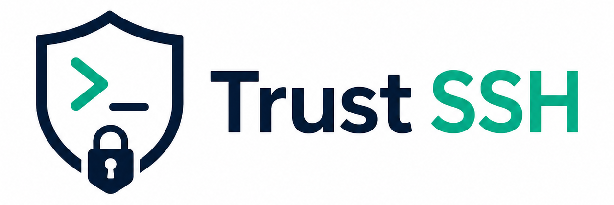
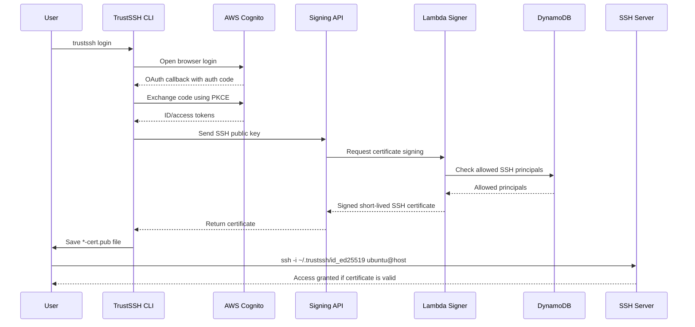

<div align="center">



**Short-lived SSH access using AWS Cognito, Lambda, and OpenSSH user certificates.**

TrustSSH is an SSH login broker that lets users authenticate through AWS Cognito and receive short-lived OpenSSH user certificates. It is designed to keep normal SSH workflows intact while removing the need for long-lived authorised public keys on servers.


</div>

---

## Overview

TrustSSH provides a way to issue temporary SSH access without uploading or exposing a user's private key. Replacing long-lived SSH keys with short-lived certificates issued after successful identity authentication.

The Go CLI authenticates the user through AWS Cognito, sends their SSH **public key** to a signing API, and receives a short-lived OpenSSH certificate. The user can then connect using normal SSH commands until the certificate expires.


> **Users keep their private keys. TrustSSH only signs public keys for approved SSH principals.**

### Key benefits

- **Short-lived access** — certificates can expire after minutes instead of months or years.
- **No private key upload** — the CLI only sends the user's SSH public key.
- **Normal SSH commands** — users still connect with standard `ssh`.
- **Centralised access control** — allowed SSH principals are controlled by the backend.

---

## How It Works



---

## CLI Commands

```bash
trustssh configure <base-url>
trustssh passkeys add
trustssh login
trustssh logout
```

### `trustssh configure <base-url>`

Downloads the TrustSSH client configuration from:

```text
<base-url>/config.json
```

and saves it locally to:

```text
~/.trustssh/config.json
```

Example:

```bash
trustssh configure https://trustssh.demo.com
```

### `trustssh login`

Starts the login flow and requests a short-lived SSH certificate.

The command will:

1. Open the Cognito managed login page in the browser.
2. Receive the localhost OAuth callback.
3. Exchange the authorisation code using PKCE.
4. Create or reuse `~/.trustssh/id_ed25519`.
5. Send `~/.trustssh/id_ed25519.pub` to the signing API.
6. Save the returned certificate as `~/.trustssh/id_ed25519-cert.pub`.

### `trustssh logout`

Removes local TrustSSH tokens and the short-lived certificate.

It does **not** remove the SSH key pair.

### `trustssh passkeys add`

Registers a passkey for the current user where passkey support is enabled by the deployed authentication flow.

---

## Demo

Before logging in, SSH access is denied because no valid certificate exists:

```bash
user@MacBook TrustSSH % ssh -i ~/.trustssh/id_ed25519 ubuntu@demo.com
ubuntu@demo.com: Permission denied (publickey).
```

Login using the TrustSSH CLI:

```bash
user@MacBook TrustSSH % trustssh login
Opening browser for Cognito login...
Requesting 30 minute certificate...
Authenticated as demo@example.com
Using SSH key: ~/.trustssh/id_ed25519.pub
Allowed SSH principals: ubuntu, demo
Certificate saved: ~/.trustssh/id_ed25519-cert.pub
Certificate valid until: 2026-05-09T14:38:28Z
Tokens saved: /Users/user/.trustssh/tokens.json
You can now use normal SSH commands.
```

After login, SSH works using the short-lived certificate:

```bash
user@MacBook TrustSSH % ssh -i ~/.trustssh/id_ed25519 ubuntu@demo.com
Welcome to Ubuntu 24.04 LTS (GNU/Linux 6.17.2-1-pve x86_64)

ubuntu@ssh-demo:~$
```

---

## Security Model

TrustSSH is designed so that the user's private key never leaves their machine.

| Component | Behaviour |
|---|---|
| SSH private key | Stored locally on the user's machine |
| SSH public key | Sent to the signing API |
| SSH certificate | Returned by the API and saved locally |
| Access control | Decided by backend mapping of user identity to allowed SSH principals |
| Certificate lifetime | Short-lived |
| Server access | Granted only when the OpenSSH certificate is valid and trusted by the server CA |

---

## Server Requirements

SSH servers must trust the TrustSSH CA public key.

```bash
#/etc/ssh/sshd_config
TrustedUserCAKeys /etc/ssh/trustssh_ca.pem
```

---

## Documentation

| Document | Description |
|---|---|
| [AWS deployment](docs/aws-deployment.md) | Deploy the Cognito, Lambda, API Gateway, DynamoDB, and related AWS infrastructure. |
| [CLI deployment](docs/cli-deployment.md) | Build, configure, and use the TrustSSH CLI. |
| [Request flow](docs/request-flow.md) | Detailed explanation of the authentication and certificate signing flow. |

---
