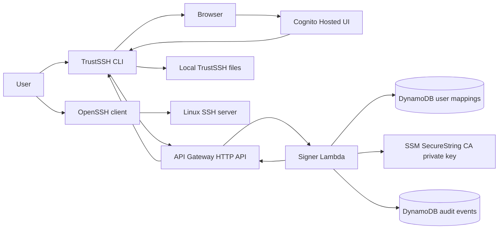
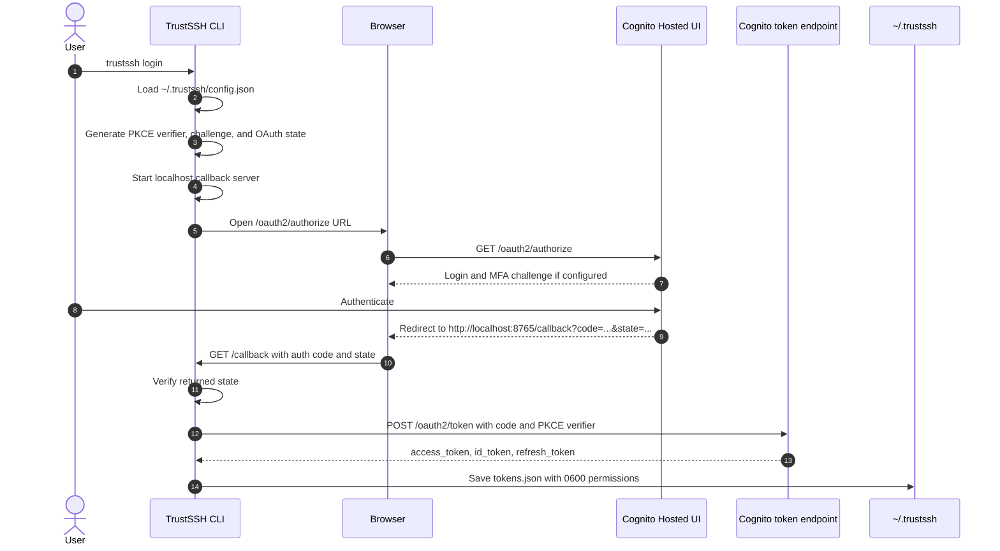
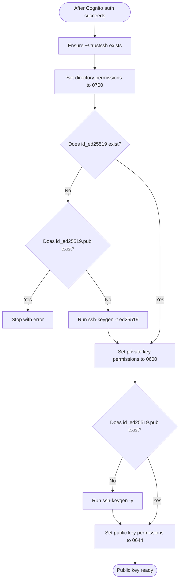
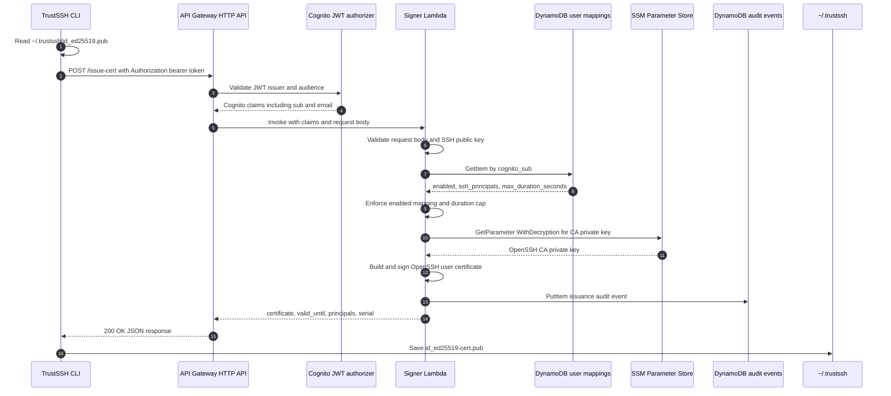
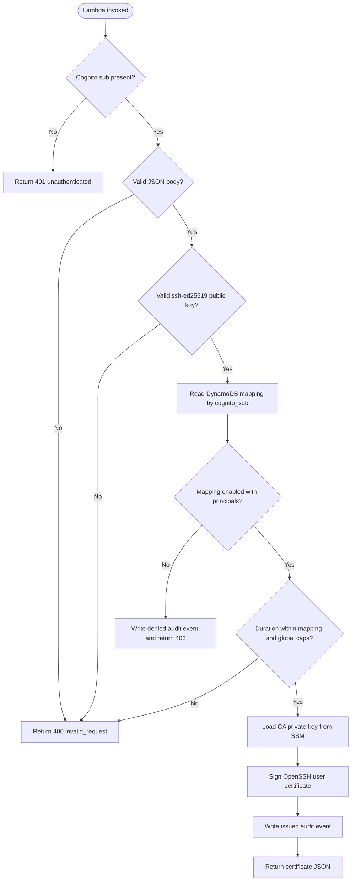
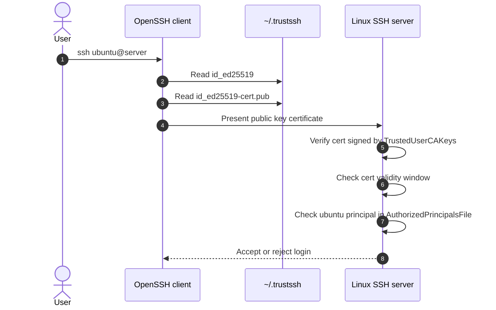

# Request Flow

This document shows how data moves through TrustSSH during `trustssh login`, certificate issuance, and normal SSH login.

TrustSSH does not send the user's SSH private key to AWS. The CLI signs nothing locally and sends only the SSH public key plus a Cognito bearer token to the API.

## End-to-End View



## Login and Token Flow



The authorization request contains:

```text
response_type=code
client_id=<cognito client id>
redirect_uri=http://localhost:8765/callback
scope=openid email profile
code_challenge=<PKCE challenge>
code_challenge_method=S256
state=<random state>
```

The token exchange request is form-encoded:

```text
grant_type=authorization_code
client_id=<cognito client id>
code=<authorization code>
redirect_uri=http://localhost:8765/callback
code_verifier=<PKCE verifier>
```

Token response:

```json
{
  "access_token": "...",
  "id_token": "...",
  "refresh_token": "...",
  "token_type": "Bearer",
  "expires_in": 3600
}
```

## Local SSH Key Preparation



Local files:

```text
~/.trustssh/config.json
~/.trustssh/tokens.json
~/.trustssh/id_ed25519
~/.trustssh/id_ed25519.pub
~/.trustssh/id_ed25519-cert.pub
```

Permissions:

```text
~/.trustssh                 0700
id_ed25519                  0600
id_ed25519.pub              0644
id_ed25519-cert.pub         0644
tokens.json                 0600
```

## Certificate Issuance Flow



CLI request:

```http
POST /issue-cert
Authorization: Bearer <cognito access token>
Content-Type: application/json
```

```json
{
  "public_key": "ssh-ed25519 AAAA... trustssh",
  "requested_duration_seconds": 1800
}
```

API Gateway checks:

```text
issuer   = https://cognito-idp.<region>.amazonaws.com/<user-pool-id>
audience = <cognito app client id>
```

Lambda uses these JWT claims:

```json
{
  "sub": "aaaaaaaa-bbbb-cccc-dddd-eeeeeeeeeeee",
  "email": "user@example.com"
}
```

Mapping lookup key:

```json
{
  "cognito_sub": "aaaaaaaa-bbbb-cccc-dddd-eeeeeeeeeeee"
}
```

Expected mapping item:

```json
{
  "cognito_sub": "aaaaaaaa-bbbb-cccc-dddd-eeeeeeeeeeee",
  "email": "user@example.com",
  "enabled": true,
  "ssh_principals": ["ubuntu"],
  "max_duration_seconds": 1800
}
```

Successful response:

```json
{
  "certificate": "ssh-ed25519-cert-v01@openssh.com AAAA...",
  "valid_until": "2026-05-07T18:30:00Z",
  "principals": ["ubuntu"],
  "serial": 12345
}
```

The certificate is saved to:

```text
~/.trustssh/id_ed25519-cert.pub
```

## Lambda Decision Logic



## Audit Event

The Lambda writes one audit event for successful certificate issuance. It also writes denied events when the Cognito user has no enabled mapping.

Audit table keys:

```text
cognito_sub
issued_at_serial
```

Issued event:

```json
{
  "cognito_sub": "aaaaaaaa-bbbb-cccc-dddd-eeeeeeeeeeee",
  "issued_at_serial": "2026-05-07T18:00:00Z#12345",
  "email": "user@example.com",
  "principals": ["ubuntu"],
  "serial": 12345,
  "valid_until": "2026-05-07T18:30:00Z",
  "outcome": "issued"
}
```

Denied event:

```json
{
  "cognito_sub": "aaaaaaaa-bbbb-cccc-dddd-eeeeeeeeeeee",
  "issued_at_serial": "2026-05-07T18:00:00Z#0",
  "email": "user@example.com",
  "principals": [],
  "serial": 0,
  "valid_until": "",
  "outcome": "denied"
}
```

## Normal SSH Login



The CLI does not run SSH. OpenSSH automatically pairs:

```text
~/.trustssh/id_ed25519
~/.trustssh/id_ed25519-cert.pub
```

## Data Handling Summary

| Data | Source | Destination | Notes |
| --- | --- | --- | --- |
| PKCE verifier | CLI | Cognito token endpoint | Never sent in the browser authorization request |
| Authorization code | Cognito | CLI localhost callback | Exchanged once for tokens |
| Access token | Cognito | CLI, API Gateway | Used as bearer token for `/issue-cert` |
| ID token | Cognito | CLI local token file | Decoded locally for display |
| SSH private key | CLI local machine | Local filesystem only | Never sent to AWS |
| SSH public key | CLI local machine | Signer Lambda | Sent in `/issue-cert` request |
| CA private key | `terraform.tfvars` then SSM | Signer Lambda | Stored as SSM SecureString and present in Terraform state |
| CA public key | `terraform.tfvars` then SSM | Server setup/reference | Lambda does not need this value |
| SSH certificate | Signer Lambda | CLI local filesystem | Short-lived OpenSSH user cert |
| Audit event | Signer Lambda | DynamoDB audit table | No tokens or private keys |
